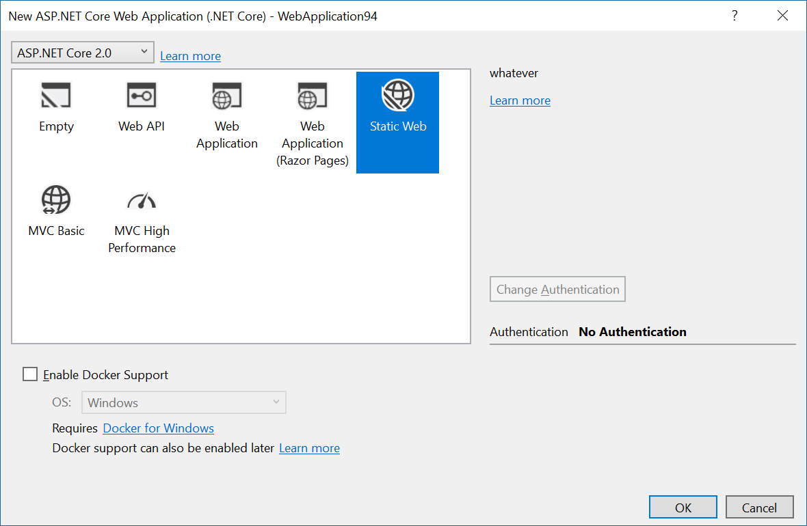
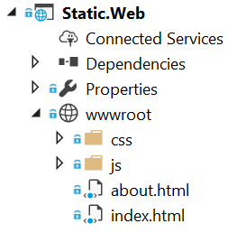
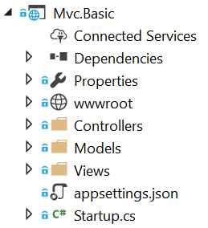

# ASP.NET Core Template Pack

Contains various project templates for ASP.NET Core development.

## Install

### Command line
In the console, execute the following command:

`dotnet new -i "AspNetCore.Web.Templates::*"`

### Visual Studio 2017.3
The extension adds the project template to the ASP.NET New Project dialog:

## Templates

### Static Website
Uses the ASP.NET Core project system to provide the latest features in Visual Studio web tooling to create a completely static website. No C# in the project at all - just plain old CSS, JavaScript and HTML.

#### Use

`dotnet new staticweb -n myapp`

### MVC Basic
This template makes it super easy to get started with building an ASP.NET Core MVC application. It doesn't have any dependencies on Bower, npm, BundlerMinifier, Bootstrap, jQuery or anything else. It's the perfect starting point for developers that know their ASP.NET Core.

#### Use

`dotnet new mvcbasic -n myapp`